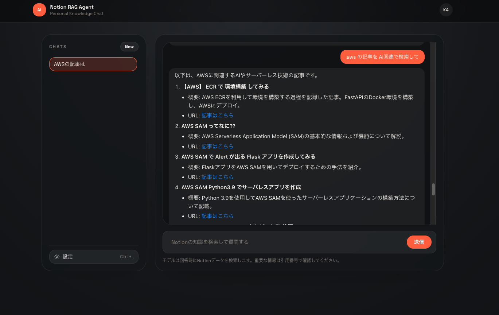

# RAG Accuracy Improvements

This document describes the improvements made to address the RAG accuracy issues documented in `99-issues.md`.

## Summary

The RAG system was returning low-relevance documents and producing generic answers. This was caused by retrieval and ranking behavior issues. The following improvements were implemented to address these problems.

## Implemented Changes

### 1. Tool Enablement Based on Similarity Threshold

**Problem**: Tools-based re-search was only enabled when there were zero initial matches.

**Solution**: Added `shouldEnableTools()` function that enables tools when the top match similarity is below a configurable threshold.

```typescript
// src/lib/rag.ts
export function shouldEnableTools(matches: RagMatch[]) {
  if (matches.length === 0) return true;
  const maxSim = getMaxSimilarity(matches);
  return maxSim < getToolThreshold();
}
```

**Configuration**: `RAG_TOOL_THRESHOLD` environment variable (default: 0.5)

### 2. Japanese Keyword Extraction

**Problem**: Keyword extraction only supported alphanumeric tokens (`[A-Za-z0-9]`), causing Japanese queries to fail keyword search.

**Solution**: Extended `extractKeywords()` to support Japanese characters (hiragana, katakana, kanji) and added fallback to use the full query when no tokens are found.

```typescript
// Match Japanese tokens (hiragana, katakana, kanji)
const japaneseTokens =
  query.match(/[\u3040-\u309F\u30A0-\u30FF\u4E00-\u9FAF]+/g) ?? [];
```

### 3. Recency-Aware Ranking

**Problem**: Retrieval did not consider `last_edited_time`, so "recent" or "latest" intent was ignored.

**Solution**: Added recency detection and scoring:

- `hasRecencyIntent()`: Detects recency keywords in both English and Japanese
  - English: "recent", "latest", "new", "today", "yesterday", etc.
  - Japanese: "最新", "最近", "新しい", "今日", "昨日"

- `getRecencyScore()`: Calculates a score (0-1) based on `last_edited_time` metadata

- Modified sorting to consider recency when the query has recency intent

```typescript
// Sort priority when recency intent detected:
// 1. Keyword score (if keywords exist)
// 2. Recency score
// 3. Similarity score
```

## Modified Files

| File | Changes |
|------|---------|
| `src/lib/rag.ts` | Added tool threshold, Japanese keyword support, recency detection and ranking |
| `src/app/api/chat/route.ts` | Updated to use `shouldEnableTools()` function |
| `CLAUDE.md` | Added `RAG_TOOL_THRESHOLD` environment variable documentation |

## New Environment Variables

| Variable | Description | Default |
|----------|-------------|---------|
| `RAG_TOOL_THRESHOLD` | Similarity threshold for enabling search tools | 0.5 |

## Remaining Considerations

The following improvements from `99-issues.md` were not implemented in this change:

- **Stronger embeddings**: Consider using `text-embedding-3-large` for higher recall (currently using `text-embedding-3-small`)

## Testing

To verify the improvements:

1. Test Japanese queries to confirm keyword extraction works
2. Test queries with recency intent ("最新の記事", "recent articles") to confirm recency ranking
3. Test queries with low-similarity matches to confirm tool re-search is triggered

## Test Results


