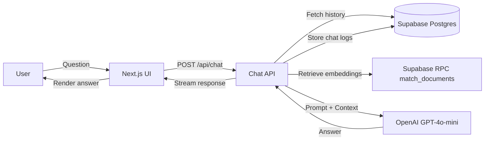
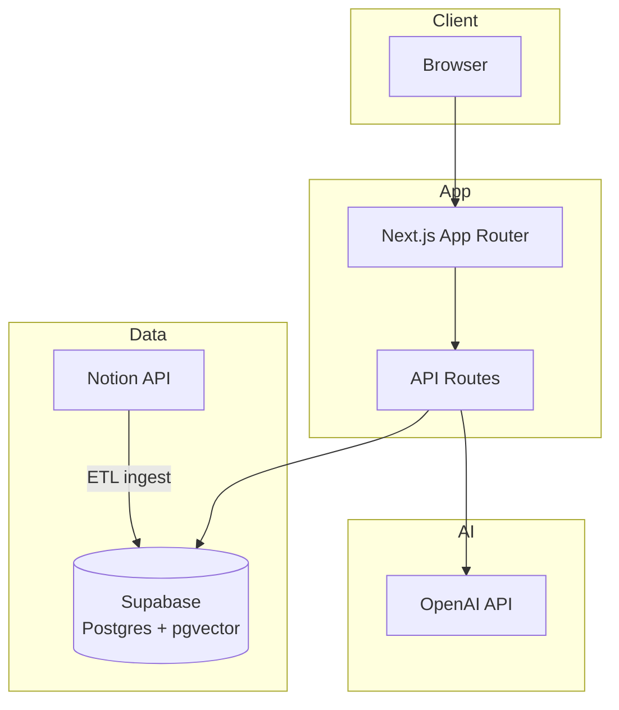

# Architecture

## Data Flow

## Services Overview

## Repository Notes

- `scripts/ingest-notion.ts` ingests Notion pages into `documents` with embeddings.
- `supabase/schema.sql` defines `documents`, `chat_logs`, and `chat_sessions`.
- `src/app/api/chat/route.ts` logs conversations and rebuilds history per `chat_id`.
- `src/app/api/chat/logs/route.ts` returns chat logs for a session.
- `src/app/api/chat/sessions/route.ts` lists available chat sessions.
